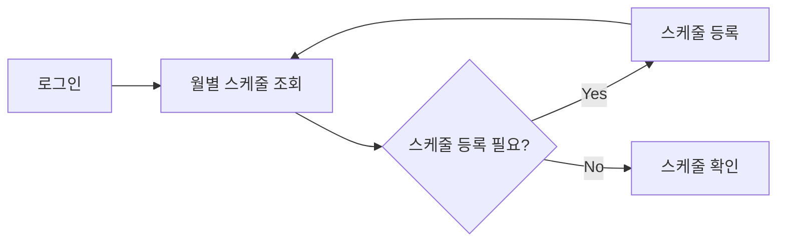
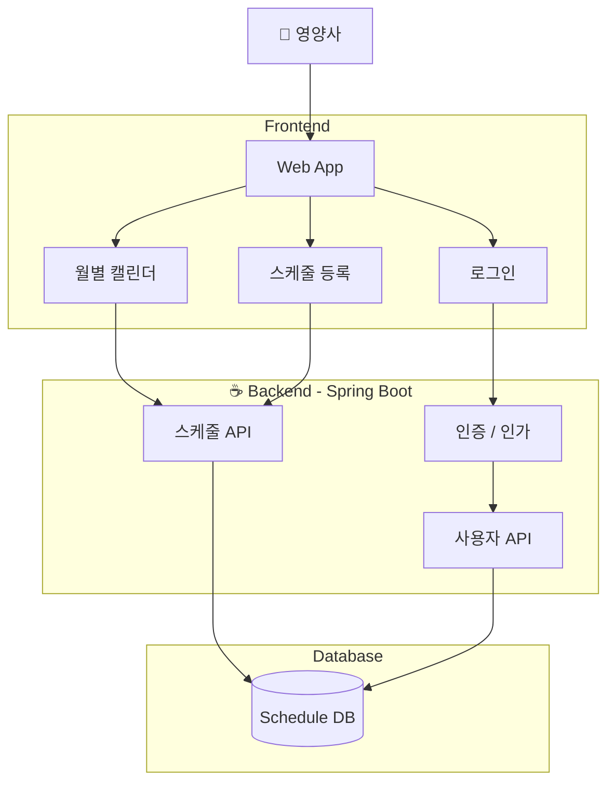
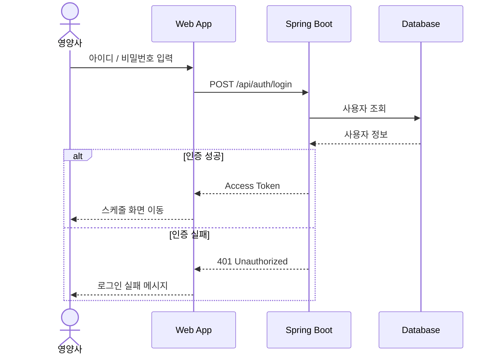
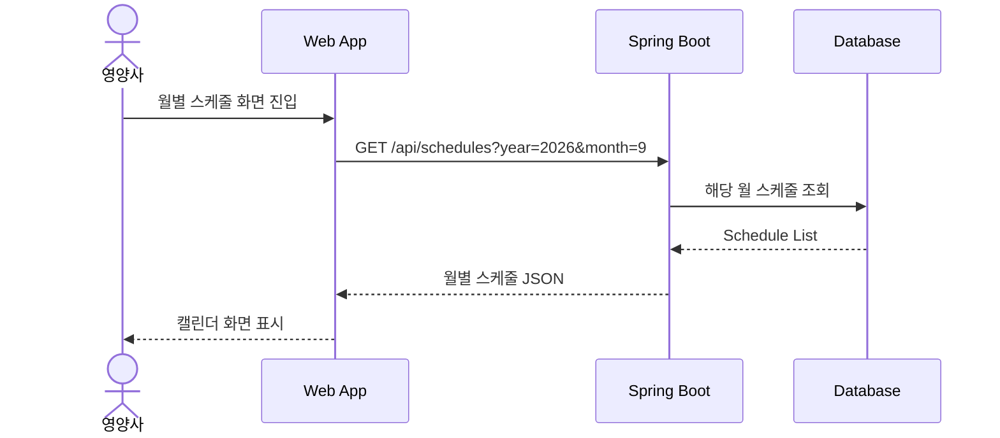
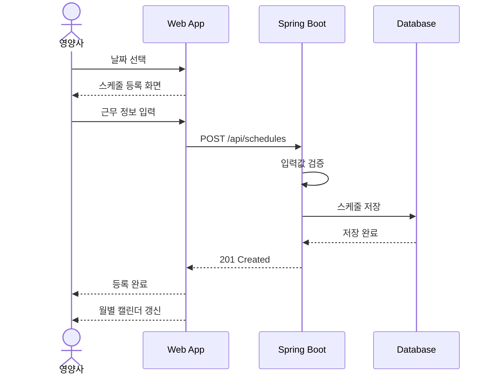
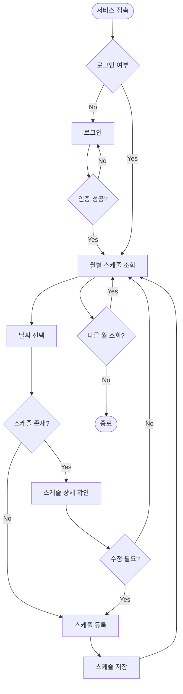

# dietitian-scheduler
영양사 근무 스케줄 기록 앱

# 영양사 근무 스케줄러

영양사가 기존에 사용하던 **Excel 기반 근무 스케줄 데이터를 웹에 등록하고, 스마트폰에서 캘린더 형태로 편리하게 조회**할 수 있도록 하는 스케줄 관리 서비스

## 프로젝트 목적
병원 및 기관에서 관리되는 영양사 근무 스케줄은 Excel 등의 문서 형태로 관리되는 경우가 많음
이 프로젝트는 이러한 스케줄 데이터를 웹 서비스에 저장하여 아래의 기능들을 제공할 예정

- 스마트폰에서 쉽게 확인
    
- 월별 캘린더 형태로 조회
    
- 개인별 로그인 및 스케줄 관리
    
- 향후 Excel 자동 등록 지원

---

## MVP 범위


|기능|설명|
|---|---|
|로그인|사용자 인증 및 세션 관리|
|스케줄 등록|근무일, 근무 유형 등의 스케줄 등록|
|스케줄 조회|월별 근무 스케줄 조회|
|모바일 UI|스마트폰에서 보기 편한 반응형 UI|

### MVP 사용자 흐름



---

# 전체 시스템 구조

Spring Boot 기반의 REST API 서버와 모바일 웹 기반의 프론트엔드로 구성



---

# 로그인 프로세스

사용자는 자신의 계정으로 로그인한 후 스케줄을 조회하고 등록



---

# 월별 스케줄 조회 프로세스

로그인 이후 기본 화면은 **현재 월의 스케줄을 보여주는 캘린더 화면**으로 구성



### API 예시

```
GET /api/schedules?year=2026&month=9
Authorization: Bearer {accessToken}
```

Response:

```json
{
  "year": 2026,
  "month": 9,
  "schedules": [
    {
      "date": "2026-09-01",
      "type": "DAY",
      "startTime": "09:00",
      "endTime": "18:00"
    },
    {
      "date": "2026-09-02",
      "type": "OFF"
    }
  ]
}
```

---

# 스케줄 등록 프로세스

사용자는 특정 날짜의 근무 정보를 등록하거나 수정
- *우선은 수정은 통째로 해당 월 엎어칠 예정*



---

# 전체 사용자 프로세스

MVP의 전체적인 프로세스 흐름


